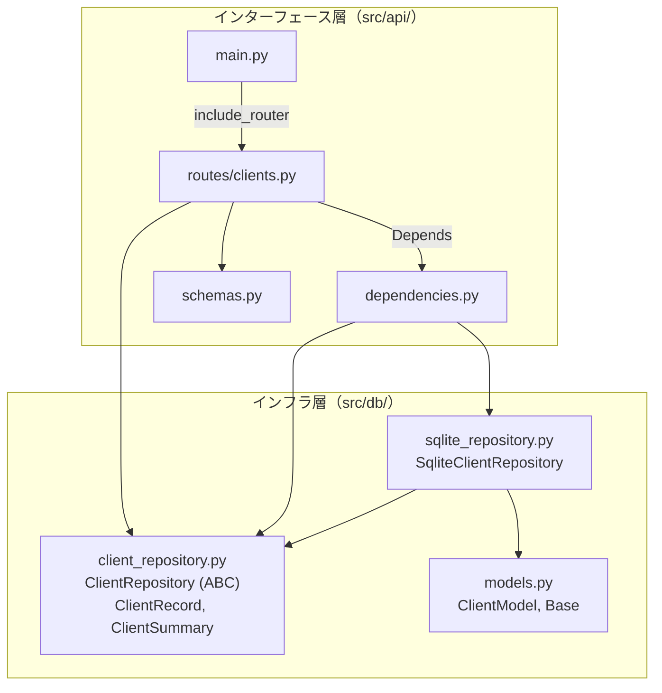

# 設計: クライアントデータ永続化（ep4.5 Phase 1）

作成日: 2026-06-17

---

## 概要

FPがクライアントごとにシミュレーション入力内容（SimulateRequest 相当の dict）を SQLite に保存・呼び出し・更新・削除できるようにする。Repository パターンで DB 実装を分離し、FastAPI の DI で注入する。

---

## 変更ファイル一覧

| ファイル | 変更種別 | 層 | 理由 |
| -------- | -------- | -- | ---- |
| `src/db/__init__.py` | 新規 | インフラ | パッケージ化 |
| `src/db/models.py` | 新規 | インフラ | SQLAlchemy テーブル定義 |
| `src/db/client_repository.py` | 新規 | インフラ | 抽象 Repository + データクラス（ClientRecord, ClientSummary） |
| `src/db/sqlite_repository.py` | 新規 | インフラ | SQLite 実装 |
| `src/api/dependencies.py` | 新規 | インターフェース | DI 設定（Repository のファクトリ） |
| `src/api/routes/clients.py` | 新規 | インターフェース | CRUD エンドポイント |
| `src/api/schemas.py` | 変更 | インターフェース | ClientSaveRequest, ClientResponse, ClientListItem 追加 |
| `src/api/main.py` | 変更 | インターフェース | ルーター追加 + CORS 更新 |

---

## データモデル

### SQLAlchemy モデル（`src/db/models.py`）

```python
from sqlalchemy import Column, Integer, String, Text, DateTime
from sqlalchemy.orm import DeclarativeBase
from datetime import datetime, timezone


class Base(DeclarativeBase):
    pass


class ClientModel(Base):
    __tablename__ = "clients"

    id: int = Column(Integer, primary_key=True, autoincrement=True)
    name: str = Column(String(255), nullable=False)
    scenario: str = Column(Text, nullable=False)  # JSON 文字列
    created_at: datetime = Column(
        DateTime, nullable=False, default=lambda: datetime.now(timezone.utc)
    )
    updated_at: datetime = Column(
        DateTime, nullable=False,
        default=lambda: datetime.now(timezone.utc),
        onupdate=lambda: datetime.now(timezone.utc),
    )
```

**設計判断:**
- テーブル名は `clients`（複数形）。SQLAlchemy モデルクラス名は `ClientModel`。ドメインの `Client` dataclass（`src/domain/models.py`）と衝突させない
- `scenario` は `Text` 型に JSON 文字列として保存する。SQLite の JSON 関数は使わない（検索不要・ポータビリティ優先）
- `id` は `Integer AUTOINCREMENT`。UUID ではない（ローカル単一ユーザーアプリで UUID は過剰）
- タイムスタンプは UTC で保存する

### データクラス（`src/db/client_repository.py`）

Repository の入出力に使う。SQLAlchemy モデルへの依存を Repository の外に漏らさないための境界オブジェクト。

```python
from dataclasses import dataclass
from datetime import datetime


@dataclass(frozen=True)
class ClientRecord:
    """単体クライアントの完全データ（scenario 含む）"""
    id: int
    name: str
    scenario: dict          # JSON をデシリアライズ済み
    created_at: datetime
    updated_at: datetime


@dataclass(frozen=True)
class ClientSummary:
    """一覧表示用の軽量データ（scenario を含まない）"""
    id: int
    name: str
    updated_at: datetime
```

**設計判断:**
- `frozen=True` にする。Repository から返された値が呼び出し元で変更されることを防ぐ
- `id` は `int`。テスト仕様では `str` と書かれているが、AUTOINCREMENT に合わせて `int` にする（ユーザー指示）
- `scenario` は `dict` で返す。JSON 文字列のシリアライズ/デシリアライズは Repository 実装の内部責務

---

## インターフェース

### 抽象 Repository（`src/db/client_repository.py`）

```python
from abc import ABC, abstractmethod


class ClientRepository(ABC):

    @abstractmethod
    def create(self, name: str, scenario: dict) -> ClientRecord:
        """クライアントを新規作成する。

        name が空文字または空白のみの場合は ValueError を送出する。
        """

    @abstractmethod
    def list_all(self) -> list[ClientSummary]:
        """全クライアントの一覧を updated_at 降順で返す。"""

    @abstractmethod
    def get(self, client_id: int) -> ClientRecord | None:
        """指定 ID のクライアントを返す。存在しなければ None。"""

    @abstractmethod
    def update(self, client_id: int, name: str, scenario: dict) -> ClientRecord:
        """指定 ID のクライアントを更新する。

        存在しない ID の場合は ValueError を送出する。
        name が空文字または空白のみの場合は ValueError を送出する。
        """

    @abstractmethod
    def delete(self, client_id: int) -> None:
        """指定 ID のクライアントを削除する。

        存在しない ID の場合は ValueError を送出する。
        """
```

### SQLite 実装（`src/db/sqlite_repository.py`）

```python
from sqlalchemy import create_engine
from sqlalchemy.orm import Session

from src.db.models import Base, ClientModel
from src.db.client_repository import ClientRepository, ClientRecord, ClientSummary


class SqliteClientRepository(ClientRepository):

    def __init__(self, db_url: str = "sqlite:///clients.db") -> None:
        """SQLite に接続し、テーブルを自動作成する。

        テスト時は db_url="sqlite:///:memory:" を渡す。
        """

    def create(self, name: str, scenario: dict) -> ClientRecord: ...
    def list_all(self) -> list[ClientSummary]: ...
    def get(self, client_id: int) -> ClientRecord | None: ...
    def update(self, client_id: int, name: str, scenario: dict) -> ClientRecord: ...
    def delete(self, client_id: int) -> None: ...
```

**実装上のポイント:**
- `__init__` で `create_engine` + `Base.metadata.create_all` を呼ぶ（テーブル自動作成）
- 各メソッドは内部で `Session` を開閉する（with 文）
- `name` のバリデーション（`name.strip()` が空なら `ValueError`）は `create` と `update` の両方で行う。private メソッド `_validate_name(name: str) -> str` に切り出し、strip 済みの name を返す
- `scenario` の dict <-> JSON 変換は `json.dumps` / `json.loads` で行う
- `list_all` は `order_by(ClientModel.updated_at.desc())` で降順ソート

### DI 設定（`src/api/dependencies.py`）

```python
import os
from functools import lru_cache

from src.db.client_repository import ClientRepository
from src.db.sqlite_repository import SqliteClientRepository


@lru_cache(maxsize=1)
def _get_repository() -> SqliteClientRepository:
    """アプリケーション全体で1つの Repository インスタンスを共有する。"""
    db_path = os.environ.get("LES_DB_PATH", "clients.db")
    return SqliteClientRepository(db_url=f"sqlite:///{db_path}")


def get_client_repository() -> ClientRepository:
    """FastAPI Depends で注入する。テスト時は dependency_overrides で差し替える。"""
    return _get_repository()
```

**設計判断:**
- `lru_cache` で Repository をシングルトン化する。SQLAlchemy の Engine はスレッドセーフなので問題ない
- DB ファイルパスは環境変数 `LES_DB_PATH` で制御可能にする（デスクトップアプリ化時に `%APPDATA%` 配下を指定するため）
- テスト時は `app.dependency_overrides[get_client_repository]` で `:memory:` の Repository に差し替える

### API スキーマ（`src/api/schemas.py` に追加）

```python
from datetime import datetime
from pydantic import BaseModel, field_validator


class ClientSaveRequest(BaseModel):
    """POST /clients, PUT /clients/{id} のリクエストボディ"""
    name: str
    scenario: dict

    @field_validator("name")
    @classmethod
    def name_must_not_be_blank(cls, v: str) -> str:
        if not v.strip():
            raise ValueError("name は空にできません")
        return v.strip()


class ClientResponse(BaseModel):
    """POST/PUT/GET /clients/{id} のレスポンス（scenario 含む）"""
    id: int
    name: str
    scenario: dict
    created_at: datetime
    updated_at: datetime


class ClientListItem(BaseModel):
    """GET /clients の一覧要素（scenario を含まない）"""
    id: int
    name: str
    updated_at: datetime
```

**設計判断:**
- `name` のバリデーションは Pydantic の `field_validator` で行う。Repository 側でもバリデーションするが、API 層で先に 422 を返す方がユーザー体験が良い（二重バリデーション）
- `scenario` は `dict` 型で受け取る。SimulateRequest の型チェックはここでは行わない（保存時の柔軟性を優先。将来フィールドが増えても既存データが壊れない）

### CRUD エンドポイント（`src/api/routes/clients.py`）

```python
from fastapi import APIRouter, Depends, HTTPException

from src.api.dependencies import get_client_repository
from src.api.schemas import ClientSaveRequest, ClientResponse, ClientListItem
from src.db.client_repository import ClientRepository

router = APIRouter()


@router.post("/clients", response_model=ClientResponse, status_code=201)
def create_client(
    request: ClientSaveRequest,
    repo: ClientRepository = Depends(get_client_repository),
) -> ClientResponse:
    """クライアントを新規作成する。"""


@router.get("/clients", response_model=list[ClientListItem])
def list_clients(
    repo: ClientRepository = Depends(get_client_repository),
) -> list[ClientListItem]:
    """クライアント一覧を返す（scenario を含まない）。"""


@router.get("/clients/{client_id}", response_model=ClientResponse)
def get_client(
    client_id: int,
    repo: ClientRepository = Depends(get_client_repository),
) -> ClientResponse:
    """指定 ID のクライアントを返す。存在しなければ 404。"""


@router.put("/clients/{client_id}", response_model=ClientResponse)
def update_client(
    client_id: int,
    request: ClientSaveRequest,
    repo: ClientRepository = Depends(get_client_repository),
) -> ClientResponse:
    """指定 ID のクライアントを更新する。存在しなければ 404。"""


@router.delete("/clients/{client_id}", status_code=204)
def delete_client(
    client_id: int,
    repo: ClientRepository = Depends(get_client_repository),
) -> None:
    """指定 ID のクライアントを削除する。存在しなければ 404。"""
```

**エラーハンドリング方針:**
- Repository が `ValueError` を送出 → エンドポイントで `HTTPException(404)` に変換
- Pydantic の `ValidationError` → FastAPI が自動で 422 に変換
- `get` が `None` を返す → `HTTPException(404)` に変換

### main.py への変更

```python
# 追加インポート
import os
from src.api.routes import clients

# CORS 更新
cors_origins_str = os.environ.get("LES_CORS_ORIGINS", "http://localhost:3000")
cors_origins = [o.strip() for o in cors_origins_str.split(",")]

app.add_middleware(
    CORSMiddleware,
    allow_origins=cors_origins,
    allow_methods=["GET", "POST", "PUT", "DELETE"],
    allow_headers=["Content-Type"],
)

# ルーター追加
app.include_router(clients.router)

# ポート番号
if __name__ == "__main__":
    import uvicorn
    port = int(os.environ.get("LES_PORT", "49152"))
    uvicorn.run("src.api.main:app", host="0.0.0.0", port=port, reload=True)
```

### `src/db/__init__.py`

空ファイル。パッケージとして認識させるだけ。

---

## 依存関係



**依存の方向:**
- `routes/clients.py` → `client_repository.py`（抽象のみ参照）
- `routes/clients.py` → `schemas.py`（Pydantic モデルのみ参照）
- `dependencies.py` → `sqlite_repository.py`（具象を知るのはここだけ）
- `sqlite_repository.py` → `client_repository.py` + `models.py`
- `client_repository.py` は何にも依存しない（dataclass + ABC のみ）

---

## データの流れ

### POST /clients（新規作成）

```
Client --JSON--> FastAPI
  --> Pydantic: ClientSaveRequest（name バリデーション）
  --> routes/clients.py: create_client()
  --> ClientRepository.create(name, scenario_dict)
  --> SqliteClientRepository:
      1. _validate_name(name)
      2. json.dumps(scenario) → ClientModel に保存
      3. session.commit()
      4. ClientModel → ClientRecord に変換（json.loads で scenario を dict に戻す）
  --> routes/clients.py: ClientRecord → ClientResponse に変換
  --> FastAPI --JSON--> Client（HTTP 201）
```

### GET /clients（一覧）

```
Client --GET--> FastAPI
  --> routes/clients.py: list_clients()
  --> ClientRepository.list_all()
  --> SqliteClientRepository:
      1. SELECT id, name, updated_at ORDER BY updated_at DESC
      2. ClientModel → ClientSummary に変換（scenario を読まない）
  --> routes/clients.py: list[ClientSummary] → list[ClientListItem] に変換
  --> FastAPI --JSON--> Client（HTTP 200）
```

### GET /clients/{id}（単体取得）

```
Client --GET--> FastAPI
  --> routes/clients.py: get_client(client_id)
  --> ClientRepository.get(client_id)
  --> None の場合 → HTTPException(404)
  --> ClientRecord の場合 → ClientResponse に変換
  --> FastAPI --JSON--> Client（HTTP 200）
```

### PUT /clients/{id}（更新）

```
Client --JSON--> FastAPI
  --> Pydantic: ClientSaveRequest（name バリデーション）
  --> routes/clients.py: update_client(client_id, request)
  --> ClientRepository.update(client_id, name, scenario_dict)
  --> 存在しない場合 → ValueError → HTTPException(404)
  --> ClientRecord → ClientResponse に変換
  --> FastAPI --JSON--> Client（HTTP 200）
```

### DELETE /clients/{id}（削除）

```
Client --DELETE--> FastAPI
  --> routes/clients.py: delete_client(client_id)
  --> ClientRepository.delete(client_id)
  --> 存在しない場合 → ValueError → HTTPException(404)
  --> FastAPI --204 No Content--> Client
```

---

## 設計判断の根拠

### 1. なぜ Repository パターンか

| 選択肢 | メリット | デメリット |
| ------ | -------- | ---------- |
| **Repository パターン（採用）** | DB 実装の差し替えが容易。テストで `:memory:` SQLite を使える | クラスが増える |
| ルーターから直接 SQLAlchemy を使う | ファイル数が少ない | テスト時に DB をモックしにくい。ルーターが肥大化する |

Phase 3（デスクトップアプリ化）でも SQLite を使うため DB 差し替えの実需は低いが、テスタビリティの観点で Repository パターンを採用する。

### 2. なぜ id は Integer か

| 選択肢 | メリット | デメリット |
| ------ | -------- | ---------- |
| **Integer AUTOINCREMENT（採用）** | シンプル。URL が短い。デバッグしやすい | 分散環境で衝突する可能性（今回は単一ユーザーなので問題なし） |
| UUID v4 | グローバル一意性 | URL が長い。SQLite のインデックス効率が劣る。過剰 |

ローカル単一ユーザーアプリなので Integer で十分。

### 3. なぜ scenario を dict のまま保存するか（構造化しない）

| 選択肢 | メリット | デメリット |
| ------ | -------- | ---------- |
| **JSON 文字列で丸ごと保存（採用）** | スキーマ変更に強い（フィールド追加しても既存データが壊れない）。実装がシンプル | scenario 内の個別フィールドで検索できない |
| scenario の各フィールドを正規化してテーブルに展開 | 検索・集計可能 | テーブル設計が複雑。ドメインモデル変更のたびにマイグレーション必要 |

クライアント検索は name のみで十分（FPの運用）。scenario 内の検索需要はない。

### 4. なぜ name バリデーションを二重にするか（Pydantic + Repository）

API 経由のアクセスは Pydantic が守る。しかし Repository は API 以外からも呼ばれうる（CLI、バッチ処理）。防御的プログラミングとして両方でバリデーションする。

### 5. なぜ DI に lru_cache を使うか

| 選択肢 | メリット | デメリット |
| ------ | -------- | ---------- |
| **lru_cache（採用）** | シンプル。Engine の再作成を防ぐ | テスト時に cache_clear() が必要な場合がある |
| FastAPI の app.state に保持 | ライフサイクルが明確 | main.py に初期化コードが増える |
| グローバル変数 | 最もシンプル | テスト時の差し替えが困難 |

FastAPI の `dependency_overrides` でテスト時に差し替えるため、`lru_cache` の cache_clear は不要。

---

## 実装者へのノート

1. **`ClientModel` と `ClientRecord` の変換**: `sqlite_repository.py` 内に private 関数 `_to_record(model: ClientModel) -> ClientRecord` と `_to_summary(model: ClientModel) -> ClientSummary` を作る

2. **Session 管理**: 各メソッドで `with Session(self._engine) as session:` を使う。`sessionmaker` は不要（メソッドごとに短命な Session で十分）

3. **updated_at の更新**: SQLAlchemy の `onupdate` は `session.commit()` 時に自動で発火する。ただし `:memory:` テストで `time.sleep` なしだと `created_at == updated_at` のままになりうるため、テスト仕様の `test_update_when_existing_id_then_updated_at_changes` では明示的に `datetime.now(timezone.utc)` を代入するか `time.sleep(0.01)` を使うこと

4. **テスト用 fixture のセットアップ**: `tests/api/conftest.py` に以下を追加する
   ```python
   @pytest.fixture(autouse=True)
   def _override_repository(client):
       """API テスト用: :memory: SQLite の Repository を DI で注入する"""
       from src.api.dependencies import get_client_repository
       from src.db.sqlite_repository import SqliteClientRepository

       repo = SqliteClientRepository(db_url="sqlite:///:memory:")

       def override():
           return repo

       from src.api.main import app
       app.dependency_overrides[get_client_repository] = override
       yield
       app.dependency_overrides.clear()
   ```
   ただし、既存テスト（`test_simulate.py` 等）に影響しないよう `autouse` の範囲に注意すること。`tests/api/test_clients.py` 内の `conftest.py` に分離するか、`test_clients.py` 内に fixture を定義する方が安全。

5. **CORS の `allow_origins`**: 環境変数 `LES_CORS_ORIGINS` はカンマ区切りで複数オリジンを指定可能にする（例: `http://localhost:3000,http://localhost:5173`）。未設定時は `http://localhost:3000` をデフォルトにする

6. **ポート番号**: `if __name__ == "__main__"` ブロックで `LES_PORT` 環境変数を読む。デフォルトは `49152`

7. **`list_all` の最適化**: `ClientSummary` には `scenario` を含めないため、SQLAlchemy のクエリで `scenario` カラムを読まないように `query(ClientModel.id, ClientModel.name, ClientModel.updated_at)` を使うことを推奨する（大量データ時のメモリ節約）

8. **テスト仕様との差異**: テスト仕様では `client_id` の型が `str` と書かれているが、本設計では `int` にする（ユーザー指示）。テストコードでは `int` で統一すること。テスト仕様の `test_get_when_nonexistent_id_then_returns_none` は「存在しない UUID 文字列」とあるが、存在しない `int`（例: `99999`）で代替すること
